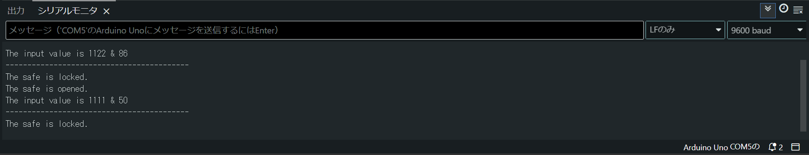
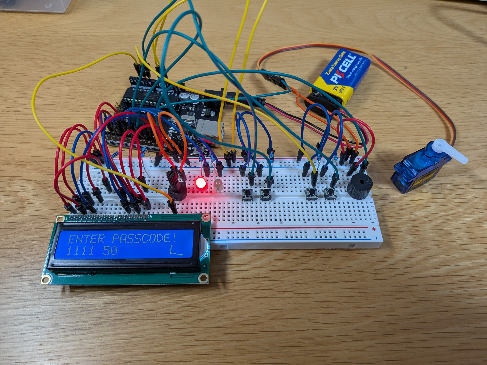
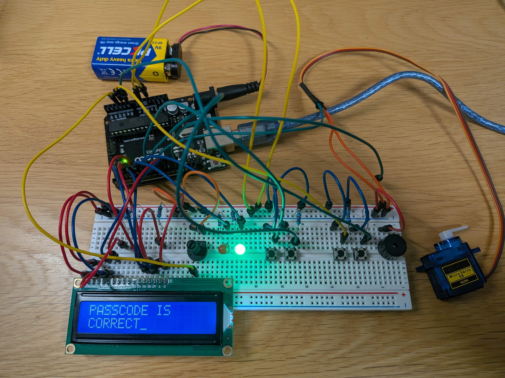
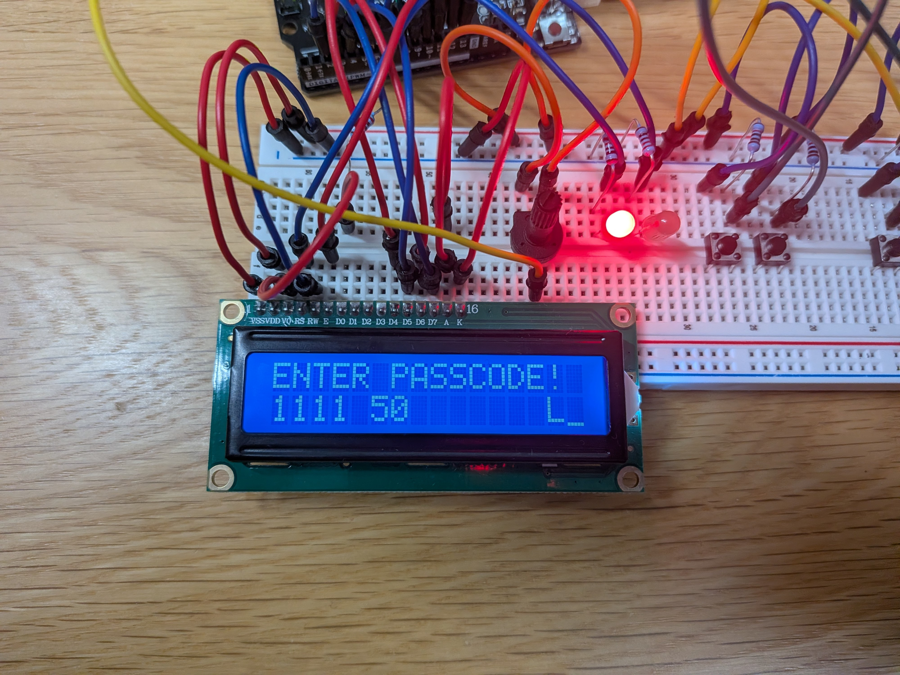

# Arduino Dual-Lock Safe

## 1. Abstract (概要)
* **What:** Arduino Unoを用いたデジタル・アナログパスコードで動く金庫システム
* **Why:** C++ベースのArduino言語を用いて、組み込みシステムの理解を深めるため
* **Result:** 「ボタン入力（デジタル）」に加え、「ダイヤル操作（アナログ）」を組み合わせた2段階認証（2-Factor Authentication）が可能

## 2. Motivation (背景と目的)
* 学部のArduinoを使った授業で作品を作る機会があった。
* 授業で学習したことと、自分で調べて身に着けた知識を形にするため。

## 3. Technical Specifications (技術仕様)

### Hardware
| Component | Model | Notes |
| --- | --- | --- |
| MCU | Arduino Uno R3 | ATmega328P,5V |
| Potentiometer | PT-15 |  |
| 5mm LED (Red) | RL5-R5015 | Super-Red (631nm) |
| 5mm LED (Green) | RL5-G8020 | Super-Green (525nm) |
| LCD Module | LCM1602A | 16x2 character LCD module |
| Passive Buzzer |  | 5V Passive buzzer |
| Micro Servo Motor | SG90 | 4.8-6V |
| 9V Lithium Battery | U9VL-J-P | 1200mAh |

### Software
* **Language:** C++ / Arduino Language
* **IDE:** Arduino IDE 2.3.6
* **Key Libraries:** 
  * stdlib.h
  * Servo.h
  * LiquidCrystal.h

## 4. Design & Theory (設計と原理)

### 4.1 Circuit Design (回路設計)
回路図は `hardware` フォルダ内のPDFを参照してください。
* [Circuit Diagram (PDF)](hardware/schematics.pdf)

**Component Selection (部品選定の根拠):**
* **LED電流制限抵抗:**
  LEDの順電圧 $V_f = 2.0V$(赤色)、$3.6V$(緑色)、目標電流 $I_f = 20mA$ と仮定( [LED_datasheet(PDF)](docs/LED_datasheet.pdf) より)。Arduinoの出力は $5V$ なので、オームの法則より
  $$R = \frac{5.0 - V_f}{I_f} $$
  したがって、赤色では $R = 150[\Omega]$ 、緑色では $R = 70[\Omega]$ となり、赤色LEDでは**220Ω**、緑色LEDでは**100Ω**の抵抗を選定した。(後に緑色LEDの抵抗を**220Ω**に変更)

### 4.2 Algorithm (アルゴリズム)
* ボタンを押した瞬間だけでなく、「指を離すまで次の処理に進まない」 というループ処理（while）を組み込むことで、連打ミス（チャタリング）を防いでいる。
* ポテンショメータの細かい数値（0〜1023）をそのまま使わず、map() 関数で 0〜100 の範囲に正規化した。これにより、人間がダイヤルを合わせやすい操作感を実現している。
* 「デジタル入力」→「アナログ入力」→「判定」という手順を、フラグ変数（reset, potenlock）を使って管理している。順序を守らないとロックが開かない仕組みを、シンプルな条件分岐で構築した。

## 5. Experimental Results (実験結果と考察)

### Results
* **パスコードが正しい場合** 
  1. **初期状態:** LCDに `ENTER PASSCODE!` と表示され、赤色LEDが点灯、サーボモータは0度（施錠位置）で固定されている。
  2. **デジタル入力:** タクトスイッチを用いて`1 1 1 1`と入力。LCDの2行目に 1111 と表示された。
  3. **アナログ入力:** ポテンショメータを回し、LCD右側の数値を変化させた。値が 50 になる位置で調整し、Enterキー（A1）を押した。LCDに `L`（Lock）が表示された。
  4. **判定:** Enterキー操作後、直ちに緑色LEDが点灯し、LCDに `CORRECT` と表示された。同時に高い音（1000Hz）が鳴り、サーボモータが90度（解錠位置）へ回転した。

* **パスコードが正しくない場合**
  * デジタルコードのみ誤り
    * **入力:** デジタル 1212 / アナログ 50
    * **結果:** LCDに `WRONG` と表示され、低い音（200Hz）が鳴り、サーボモータは動かなかった（施錠のまま）。
  * アナログコードのみ誤り
    * **入力:** デジタル 1111 / アナログ 80
    * **結果:** デジタルコードのみ誤りの場合と同様に、`WRONG` 表示と共に解錠されなかった。

* **操作性の確認**
  * **ボタン操作:** ボタンを長押ししても連続で数値が入力されることはなく、指を離したタイミングで次の桁へ進む仕様が正常に機能し、誤入力を防げることが確認できた。
  
  * **リセット機能:** 途中どのような段階であっても、リセットボタン（A0）を押すことで初期画面に戻り、変数がリセットされることを確認した。

### Discussion (考察)
実験結果に基づき、本システムのアルゴリズムとハードウェア制御について以下の考察を得た。

**1. セキュリティ強度について（二要素認証の有効性）**
  
  本システムは、離散的な数値（デジタルコード）と連続的な数値（アナログコード）を組み合わせている。単純な4桁のボタン入力（1と2のみ）だけでは $2^4 = 16$ 通りと組み合わせが少ないが、ここにアナログ入力（0〜100）の組み合わせを加えることで、総当たり攻撃に対する耐性が向上している。これは、実際のセキュリティシステムでも用いられる「知識認証（番号）」と「所持認証（鍵の位置など）」に近い多層的なセキュリティ構造を模倣できていると言える。また、ソースコードの変数の値を書き換えるだけで、デジタルコードの長さを最大で10桁に変更することが可能であり、これにより $103424$ 通りまで増やすことが可能である。

**2. 人間工学に基づいた入力処理の工夫**
  
  ソースコード内の `map(analogvalue, 0, 1023, 0, 100)` の処理は、操作性に大きく寄与している。 ポテンショメータの生データ（0〜1023）をそのままパスコードとして使用した場合、人間が手作業で「50」などの特定の値に1単位の狂いもなく合わせることは非常に困難である。これを100段階に縮約（正規化）することで、セキュリティを維持しつつ、人間がストレスなく操作できる許容範囲を設けている点は、ユーザーインターフェース設計として適切であった。

**3. チャタリング対策と確実な入力**
  
  デジタル入力関数において `while(digitalRead... == HIGH)` で「ボタンが離されるのを待つ」処理を入れたことは、誤動作防止に極めて有効であった。Arduinoのループ処理は高速であるため、この待機処理がないと一瞬の押下で複数回分の入力として判定される（チャタリングのような挙動）恐れがある。本実験ではこのアルゴリズムにより、意図した通りの桁数を正確に入力できた。

**4. 課題と改善案：アナログ値の判定精度**
  
  実験中、ポテンショメータを 50 に合わせたつもりでも、電気的なノイズや接触抵抗の微細な変化により、内部的に値がふらつく現象が想定される。 現在のコードでは `if(a == b)` と完全一致を求めているため、例えば内部値が 49 と 50 を行き来している瞬間に決定ボタンを押すと、表示は 50 でも判定時にズレて不正解となる可能性がある。 実用性をさらに高めるためには、判定ロジックに「±1〜2程度の誤差を許容する」処理を追加することで、より使いやすいシステムになると考えられる。

## 6. Usage (使い方)
**事前準備**
1. `src/Electric_safe/` 内のコードをArduinoに書き込む。
2. `hardware/schematics.pdf` を参考に配線する。

**1.各部の名称と役割**
* ボタン1（Pin 8）：数字「1」を入力する。
* ボタン2（Pin 9）：数字「2」を入力する。
* ダイヤル（Pin A2）：ポテンショメータを回して「アナログコード」を合わせる。
* 決定キー（Pin A1）：Enterボタン。数値の決定や最終的な解錠に使う。
* リセットキー（Pin A0）：入力を中断し、最初からやり直す時に使う。
* LCD画面：現在の状態や入力した数値が表示される。
* LEDランプ：赤は「ロック中」、緑は「解錠成功」を示す。
* シリアルモニタ：シリアルモニタ上で金庫の状態と入力されたパスコードを確認することができる。

**2.解錠の手順**
* **手順1:** 起動と確認 
システムを起動すると、LCD画面に ENTER PASSCODE! と表示され、赤色LED が点灯する（ロック状態）。

* **手順2:** ボタン1 と ボタン2 を使って、決められた桁数のパスワードを入力する。（初期設定パスワード:`1 1 1 1`）
ボタンを押すと画面下段に数字が表示され、入力し終わると自動的に次のステップ（ダイヤル入力）へ進む。

* **手順3:** デジタル入力が終わると、カーソルが右側に移動する。 ダイヤルを左右に回して、画面の数字を指定の値に合わせる。（初期設定値: `50`）※ 0〜100の間で数値が変化する

* **手順4:** ダイヤルの数値を合わせたら、決定キー（Enter） を 1回 押す。画面に L という文字が表示されたら、数値が固定されていることを表す。

* **手順5:** 数値が固定された状態（Lが表示された状態）で、もう一度、決定キー（Enter） を押す。成功であれば画面に CORRECT と表示され、緑色LED が点灯、高い音が鳴り、金庫（サーボモータ）が開く。失敗の場合は画面に WRONG と表示され、低いエラー音が鳴り、ロックは解除されない。

**3.施錠（リセット）の方法**

金庫を閉じてロック状態に戻すには、リセットキー を押す。サーボモータが元の位置（0度）に戻り、赤色LED が点灯し、手順1の画面に戻る。

※ 入力を間違えてやり直したい場合も、このボタンを押す。

**4.パスワードの変更方法**

コード内の以下の部分を変更して、Arduinoに書き込むことでパスワードとその桁数をを変更できる。

`#define passlen 4 //１～１０桁まで.`

`const long digitalcode = 1111; //デジタルパスコード.`

`const int analogcode = 50; //アナログパスコード（０～１００まで）.`

*※passlenの"4"の部分はデジタルパスコードの桁数を設定している。*

## 7. References (参考文献)
使用した各部品のデータシートは`docs`フォルダ内のPDFを参照してください。
* 【Arduino入門編⑰】LCDディスプレイに文字を表示させてみる！［前編］[1602 LCDモジュール] (https://burariweb.info/electronic-work/arduino-learning/arduino-lcd-module-display.html)

* kicadの使い方（回路図編）(https://www.kicad.xyz/circuit/)

[def]: images/picture1.jpg.jpg